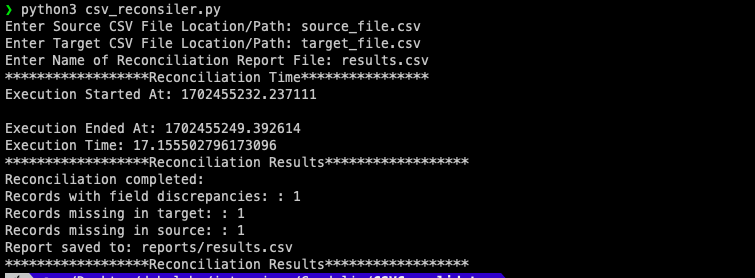
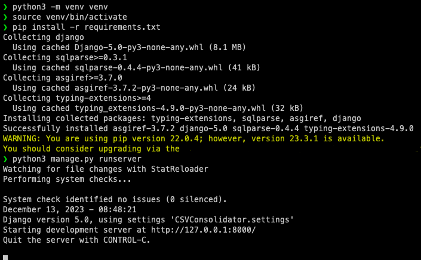
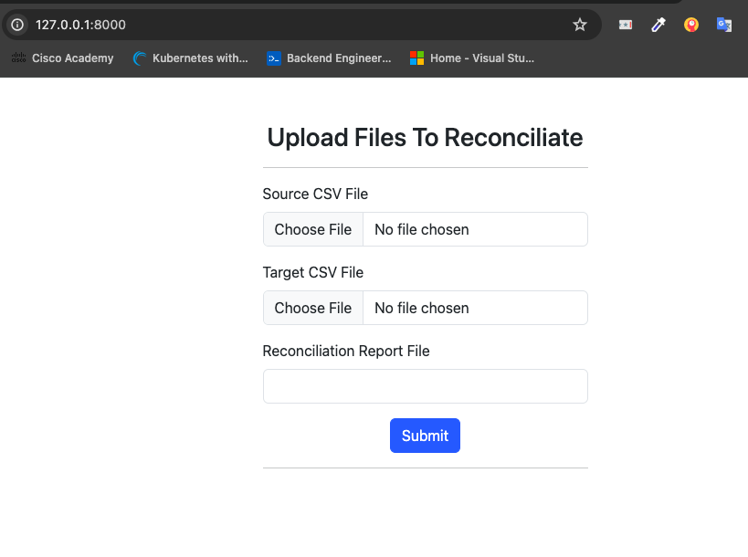

# CSV Reconciliation

### NOTES
### Have built the solution in two options, that is;-
1. A command line based python script.
2. A simple django web application

## Preliquisites
- You need Python installed to be able to successfully execute the code,
- If you don't have Python installed, download it here <link>https://www.python.org/downloads/</link>
- You are only seeing this document because you have downloaded the folder with the code, that is good.

### How to run
#### 1. Running the script on Terminal/CMD
On your terminal or cmd, run the command below (You will see a series of steps to follow): 
`python csv_reconsiler.py` or `python3 csv_reconsiler.py`

Example responses to the prompts can be as follows;-
- Enter Source CSV File Location/Path: source.csv
- Enter Target CSV File Location/Path: target.csv
- Enter Name of Reconciliation Report File: results.csv

After the above steps are complete, inside this folder(the folder you are running the code from),
look for a sub folder called reports, you will find your reconciliation report there.

#### 2. Running the script using a django web application
- The django web application was not really necessary in this case, i just thought if this was to be 
- implemented in a real world setting, probably putting a web interface would make it easily accessible,
- And also allow for easy integration with file storage systems such as S3 buckets etc.

Assuming you have Python installed, We need to first create a virtualenv so we can be sure the run the code in a isolated space/environment, it is a good practice but you can still skip it.

To create a virtual environment on;-
1. Mac & Linux
- Run the command:`python3 -m venv venv`
- To activate the virtual env us the command: `source venv/bin/activate`

2. Windows
- Run the commad: `python -m venv venv`
- To activate the virtual env us the command: `venv\Scripts\activate`

Next Step, Installing required packages/dependencies, run the command below
`pip install -r requirements.txt`

Next Step, Running the project, run the command below
`python manage.py runserver` or `python3 manage.py runserver`

Next Step, Accessing the web interface, on your browser go to: http://127.0.0.1:8000/
